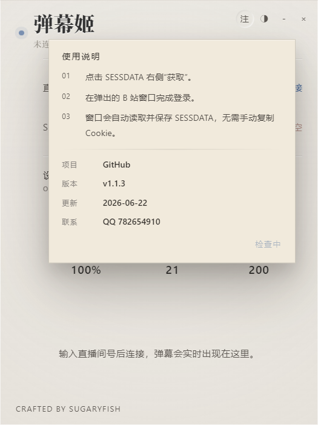
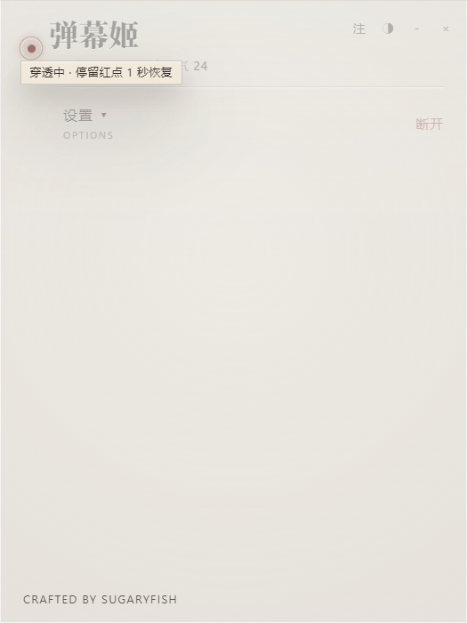
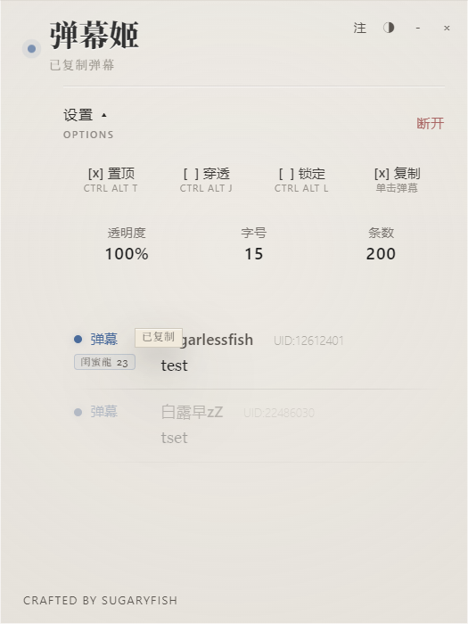
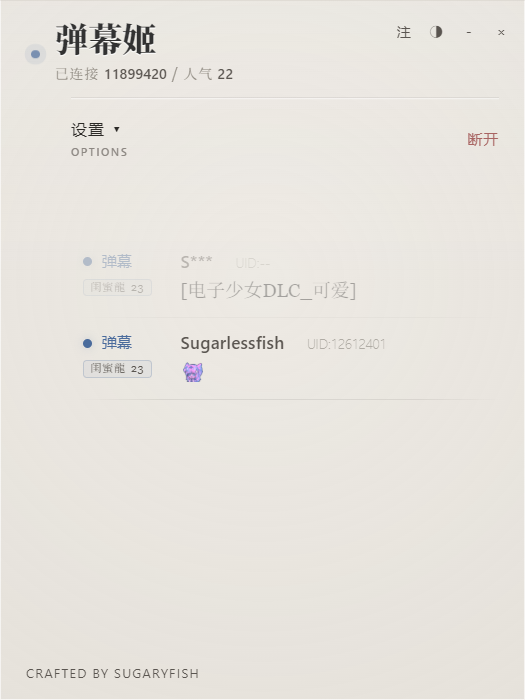

# Sugaryfish 的弹幕姬 1.1.3

## 更新亮点

- 新增 B 站全站表情解析：支持用户表情面板、直播表情、全量装扮表情包与按包懒加载。
- 修复装扮表情包前缀不一致导致无法显示的问题，例如 Ave Mujica、无数梦境纪念装扮、嘉然与嘉然2.0。
- 新增粉丝牌与等级显示：在弹幕标签下方展示紧凑灯牌，并适配 Light / Dark 主题。
- 优化表情图片尺寸约束：自动压缩到弹幕行高内，避免大图撑开列表。
- 修复表情误抓用户头像的问题，仅使用明确的表情映射或表情包明细。

## 界面截图

| 使用说明与版本信息 | 穿透恢复提示 |
| --- | --- |
|  |  |

| 单击复制与粉丝牌 | 全站表情渲染 |
| --- | --- |
|  |  |
